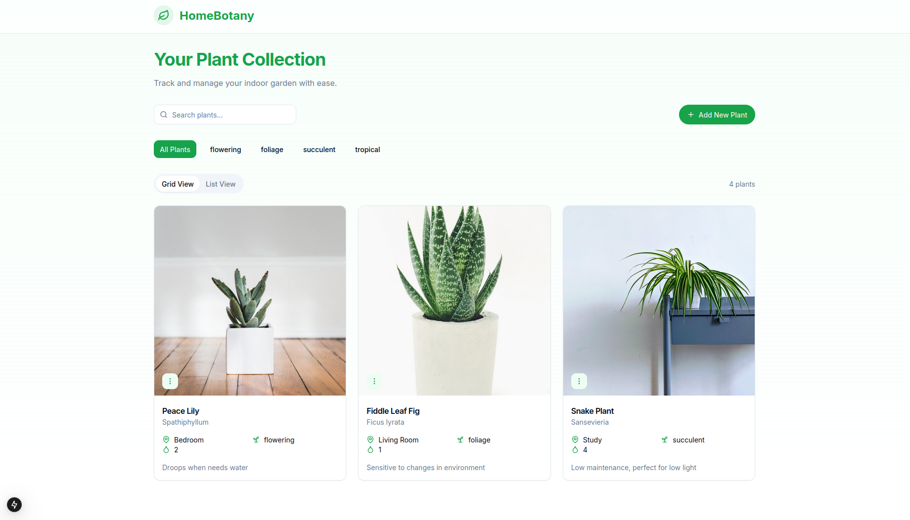

<p align="center">
  
</p>

<h1 align="center">Home Botany</h1>

Une application web simple pour vous aider à prendre soin de vos plantes.

## Table des matières

[toc]

## À propos

Home Botany est une application qui vous permet de prendre soin de vos plantes en toute simplicité. Elle offre une interface intuitive pour gérer votre collection de plantes et suivre leur évolution.

## Fonctionnalités

-   🪴 **Gestion des plantes** : Ajout, modification et suppression de plantes
-   📊 **Suivi des données** : Historique des soins et graphiques d'évolution
-   📱 **Interface responsive** : Compatible mobile et desktop

## Installation

### Prérequis

-   [Git](https://git-scm.com/downloads)
-   [Docker](https://docs.docker.com/get-docker/)
-   [Docker Compose](https://docs.docker.com/compose/install/)

### Étapes d'installation

1. Clonez le dépôt :

```bash
git clone git@github.com:dwesh163/labo-docker.git
```

2. Accédez au répertoire cloné :

```bash
cd labo-docker
```

3. Démarrez les conteneurs avec Docker Compose :

```bash
docker compose up -d --build
```

4. Accédez à l'application :

```
http://localhost
```

### Commandes utiles

**Production**

```bash
# Construire et démarrer les conteneurs
docker compose -f docker-compose.prod.yml up --build

# Consulter les logs
docker compose -f docker-compose.prod.yml logs

# Arrêter les conteneurs
docker compose -f docker-compose.prod.yml down
```

**Développement**

```bash
# Démarrer l'environnement
docker compose up

# Consulter les logs
docker compose logs

# Arrêter les conteneurs
docker compose down
```

## Environnements

### Développement

L'environnement de développement est optimisé pour faciliter le travail des développeurs :

-   Hot-reloading du front-end
-   Logs détaillés pour le débogage
-   Gestion des erreurs complète
-   Données de test pré-configurées
-   Interface Adminer pour la base de données
-   Base de données dédiée au développement

### Production

L'environnement de production est conçu pour le déploiement :

-   Images Docker optimisées
-   Permissions restreintes pour la sécurité
-   Logs minimisés
-   Application compilée et optimisée

### Différences principales

**Gestion des données**

-   _Développement_

    -   Base de données initialisée avec des données de test
    -   Persistance via des volumes Docker pour faciliter le développement
    -   Interface [**Adminer**](http://localhost:8080) disponible pour gérer la base de données

-   _Production_
    -   Pas d'interface d'administration exposée

**Système de logs**

-   _Développement_

    -   Logs détaillés de tous les services
    -   Traces des erreurs complètes
    -   Logs de développement Next.js activés
    -   Messages de débogage PostgREST visibles

-   _Production_
    -   Logs critiques uniquement
    -   Pas de données sensibles dans les logs

**Mesures de sécurité**

-   _Développement_

    -   Accès direct à la base de données autorisé
    -   Variables d'environnement de debug exposées

-   _Production_
    -   Accès à la base de données strictement limité

**Configuration du Frontend**

-   _Développement_

    -   Hot-reloading activé
    -   Source maps générées
    -   Reconstruction automatique à chaque modification

-   _Production_
    -   Build optimisé et minifié
    -   Cache configuré pour les performances
    -   Images et assets optimisés

## Architecture

### Technologies

**Frontend**

-   Next.js 15 (React 19)
-   Tailwind CSS
-   TypeScript
-   ShadcnUI

**Backend**

-   PostgreSQL 15
-   PostgREST 11

### Structure du projet

```
├── docker-compose.prod.yml
├── docker-compose.yml
├── Dockerfiles
│   ├── Dockerfile.front
│   ├── Dockerfile.postgres
│   └── Dockerfile.postgrest
├── front
│   ├── components.json
│   ├── next.config.ts
│   ├── next-env.d.ts
│   ├── package.json
│   ├── src
│   └── ...
├── init.sql
├── postgrest.conf
└── README.md
```

### Configuration Docker

**Production** (docker-compose.prod.yml)

-   **Frontend** : Build multi-étapes avec Node.js
-   **Base de données** : PostgreSQL avec initialisation personnalisée
-   **API** : PostgREST avec configuration optimisée

**Développement** (docker-compose.yml)

-   **Frontend** : Environnement Node.js avec volumes montés
-   **Base de données** : PostgreSQL avec persistence des données
-   **API** : PostgREST avec configuration de développement

## Contribution

Le projet est organisé en trois parties principales :

1. **Frontend** : Code source dans le dossier `front`
2. **Backend** : Configuration dans le dossier racine
3. **Docker** : Fichiers de configuration dans `Dockerfiles`

## Captures d'écran

<div align="center">
  
</div>
